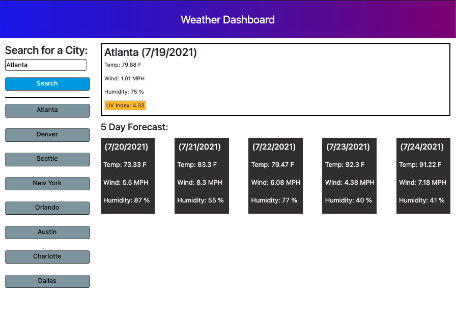

# Weather-Dashboard

# Description

    * This is a Weather Dashboard web application that can be used by the user to search for forecast 
    of multiple cites. Very useful for planning a trip correspondingly.   

# Code Description

    * When the user searches for a city, they are presented with the current weather and a five day forecast.
        * (Which will display city name, the date, the temperature, the humidity, the wind speed, and the UV index.)
    * Based on the UVIndex there will be a color based upon parameters of favorable, moderate, or severe.
    * Once a city is search it will then be added to the recent searches portion of the page, which will then be available to view again.
    * A user friendly website with updated HTML : CSS : JAVASCRIPT/JQUERY

*A live link to application

https://ilelandhayes.github.io/Weather-Dashboard/

# Image of Website 

